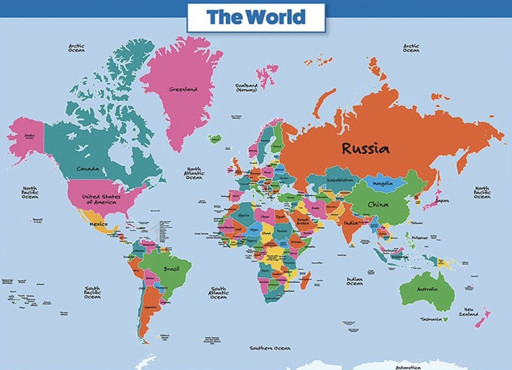

# Data Analytics (CS301) Lab 7 Assignment

## A Comparative Analysis: A Multi-Country Statistical Investigation

**Assigned** : 5 November 2025

**Due** : 12 November 2025

**Expiration date** : 19 November 2025

<center>
&#x200B;

</center>

## Objectives

This is an open-lab and focuses on developing advanced statistical analysis skills through the investigation of socioeconomic patterns across multiple countries. Students will employ multivariate regression, linear regression, descriptive statistics, and data visualization techniques to test hypotheses about phenomena in society. The lab emphasizes critical thinking about data limitations, ethical considerations in gender research, and the development of evidence-based arguments using real-world data from the World Bank's Gender Statistics database.

By the end of this assignment, students will be able to:

- Formulate and test statistical hypotheses using appropriate methods
- Apply multivariate and linear regression techniques to analyze complex relationships
- Create meaningful data visualizations to support analytical arguments  
- Critically evaluate data limitations and their impact on research conclusions
- Address ethical considerations in gender-focused data analysis

## Assignment Overview

**This is a GROUP PROJECT.** Students may work in groups of up to **two (2)** members maximum. Students may work individually if they prefer.

### Data Sources

This assignment uses the World Bank's Gender Statistics database, which provides comprehensive data on gender-related indicators across countries from 1960 to 2024. The database includes information on:

- Educational attainment and enrollment by gender
- Labor force participation and employment patterns  
- Economic opportunities and financial inclusion
- Health and reproductive indicators
- Legal rights and social protection measures
- Marriage and fertility patterns

**Data Reference:** The World Bank. Gender statistics., February 2023. Licensed under Creative Commons Attribution 4.0.

- [Data download page](https://datacatalog.worldbank.org/search/dataset/0037654/Gender-Statistics)
- [Online tool](https://databank.worldbank.org/reports.aspx?source=gender-statistics)

Three country datasets are provided in the `data/` directory: `usa.csv`, `iceland.csv`, and `venezuela.csv`. However, you may choose to download and analyze data from any other countries available in the World using the above links. 

**Note**: If you choose other countries, please make sure to include the relevant CSV files in your submission.

## Research Task: Hypothesis Development and Testing

Your team must develop and test **THREE (3) distinct hypotheses** about gender roles and their societal impacts. Each hypothesis must be:

1. **Clearly stated** with specific predictions about relationships between variables
2. **Testable** using the available World Bank data
3. **Analyzed** using appropriate statistical methods including:
   - Descriptive statistics
   - Linear regression analysis  
   - Multivariate regression modeling
   - Data visualization (plots and charts)

### Required Analysis Methods

For each hypothesis, you must employ multiple analytical approaches:

- **Descriptive Statistics:** Summary measures, trends over time
- **Linear Regression:** Simple relationships between two variables
- **Multivariate Regression:** Complex relationships with multiple predictors
- **Data Visualization:** Meaningful plots that support your analysis

### Multi-Country Comparison

Your analysis must include **at least TWO countries** from the provided datasets. This comparative approach will help you:

- To test the generalizability of your findings
- To identify cultural and economic factors that influence gender patterns
- To strengthen or challenge your hypotheses with cross-national evidence

### Hypothesis Examples (Choose Your Own)

You may explore any research questions that can be addressed with the available data. Consider themes such as:

- Economic empowerment and women's labor force participation
- Educational achievement gaps and their evolution over time
- Marriage patterns and their relationship to economic independence
- Legal rights and their correlation with social outcomes
- Health indicators and their connection to women's status
- Technology access and digital gender divides

**Note:** You are encouraged to develop original hypotheses beyond these examples.
Also, since there is a large amount of data available, please ensure that your hypotheses are focused and manageable within the scope of this assignment. It should be mentioned here that there is also a large amount of missing data in many of the datasets, so please plan accordingly.

## Data Analysis Requirements## Data Analysis Requirements

### Statistical Methods

Each hypothesis must be analyzed using **all** of the following techniques:

1. **Descriptive Statistics**
   - Summary statistics (mean, median, standard deviation, etc.)
   - Trend analysis over time periods
   - Comparative statistics across countries

2. **Linear Regression Analysis**
   - Simple linear regression for key relationships
   - Correlation analysis
   - Residual analysis and model assessment

3. **Multivariate Regression Modeling**
   - Multiple regression with 3+ predictors
   - Variable selection and model building
   - Interpretation of coefficients and significance testing

4. **Data Visualization**
   - Time series plots showing trends
   - Scatter plots for relationships
   - Comparative charts across countries
   - Professional-quality figures with proper labels and legends

### Reflection Component

Complete the reflection questionnaire in `writing/reflection.md` that addresses:

- Hypothesis development and theoretical justification
- Methodology selection and limitations
- Ethical considerations in gender research
- Data interpretation and implications
- Cross-country comparative insights

## Presentation Component

**Next lab session:** Each group will present their findings in a 5-7 minute presentation highlighting:

- Your three hypotheses and their theoretical basis
- Key methodological approaches used
- Most significant findings across countries
- Limitations and ethical considerations
- Implications for understanding gender roles

## Important Guidelines

- **Binary Gender Framework:** This analysis follows the World Bank's data collection framework, which uses binary gender categories (male/female)
- **Reproducible Code:** Submit R code that runs without errors and produces all reported results
- **Complete Documentation:** Include team member names on all submissions
- **Ethical Considerations:** Address potential biases and limitations in your analysis

## References

The World Bank. Gender statistics., February 2023. This dataset is licensed under Creative Commons Attribution 4.0.

- [Data download page](https://datacatalog.worldbank.org/search/dataset/0037654/Gender-Statistics)
- [Online tool](https://databank.worldbank.org/reports.aspx?source=gender-statistics)
---

### Required Deliverables

- **R Source Code (`src/code.r`):** Complete, executable R script that:
  - Loads and processes the selected country datasets
  - Implements all required statistical analyses for each hypothesis
  - Generates all visualizations referenced in your reflection
  - Includes clear comments explaining each analysis step
  - Runs without errors when executed by the instructor

- **Reflection Document (`writing/reflection.md`):** Comprehensive responses to all reflection questions addressing:
  - Hypothesis development and theoretical justification
  - Statistical methodology and interpretation
  - Cross-country comparative analysis
  - Ethical considerations and limitations
  - Data quality and reliability assessment

- **Data Files:** The specific CSV files from the `data/` directory used in your analysis

**Note**: You may have to download additional datasets if you choose countries other than the provided three and then place the data in the files that the submitted code will be able to use. For instance, if you choose to analyze data from Canada and Japan, you would need to download `canada.csv` and `japan.csv` from the World Bank database and include them in your submission as files that can be applied by the submitted code.

- **Group Presentation:** 5-7 minute presentation of key findings and insights

### Checks for GatorGrader

For immediate feedback on submissions, we will be using Gator Grade to inform the of missing components in the submission. As you submit, you will notice that there is a thick red X that will change to a green check mark when all components have been included in the submission. You are encouraged to click on the red X to find a listing of the components to address.

## Project Assessment

The grade that a student receives on this assignment will have the following components.

- **GitHub Actions CI Build Status [up to 10%]:**: For the lab repository associated with this assignment students will receive a checkmark grade if their last before-the-deadline build passes. This is only checking some baseline writing and commit requirements as well as correct running of the program. An additional reduction will given if the commit log shows a cluster of commits at the end clearly used just to pass this requirement. An addition reduction will also be given if there is no commit during lab work times. All other requirements are evaluated manually.

- **Mastery of Technical Writing [up to 60%]:**: Students will also receive a checkmark grade when the responses to the writing questions presented in the `reflection.md` reveal a proficiency of both writing skills and technical knowledge. To receive a checkmark grade, the submitted writing should have correct spelling, grammar, and punctuation in addition to following the rules of Markdown and providing conceptually and technically accurate answers.

- **Presentation [up to 30%]:**
Students will receive a checkmark grade for presentations. Student must be present to receive credit for presentation.

## GatorGrade

You can check the baseline writing and commit requirements for this lab assignment by running department's assignment checking `gatorgrade` tool. To use `gatorgrade`, you first need to make sure you have Python3 installed (type `python --version` to check). If you do not have Python installed, please see:

- [Setting Up Python on Windows](https://realpython.com/lessons/python-windows-setup/)
- [Python 3 Installation and Setup Guide](https://realpython.com/installing-python/)
- [How to Install Python 3 and Set Up a Local Programming Environment on Windows 10](https://www.digitalocean.com/community/tutorials/how-to-install-python-3-and-set-up-a-local-programming-environment-on-windows-10)

Then, if you have not done so already, you need to install `gatorgrade`:

- First, [install `pipx`](https://pypa.github.io/pipx/installation/)
- Then, install `gatorgrade` with `pipx install gatorgrade`

Finally, you can run `gatorgrade`:

`gatorgrade --config config/gatorgrade.yml`

## Submitting Your Work

Use GitHub to submit your work. The commands are the following.

```bash
git add -A
git commit -m "add meaningful commit message"
git push
```

## Seeking Assistance

* Extra resources for using markdown include;
  + [Markdown Tidbits](https://www.youtube.com/watch?v=cdJEUAy5IyA)
  + [Markdown Cheatsheet](https://github.com/adam-p/markdown-here/wiki/Markdown-Cheatsheet)
* Do not forget to use the above git commands to push your work to the cloud for the instructor to grade your assignment. You can go to your GitHub repository using your browser to verify that your files have been submitted. Please see the TL’s or the instructor if you have any questions about assignment submission.

Students who have questions about this project outside of the lab time are invited to ask them in the course's Discord channel or during instructor's or TL's office hours.
